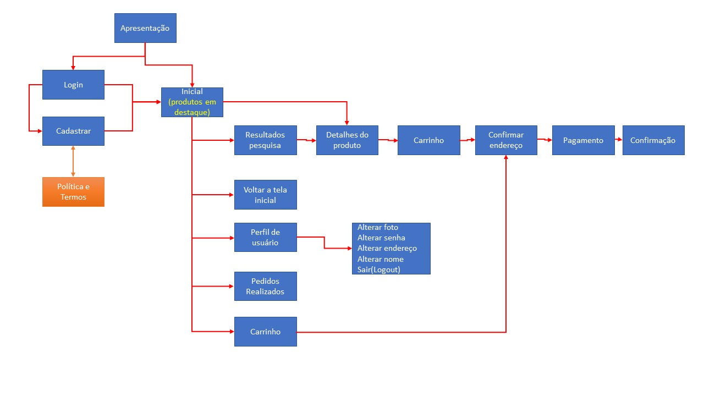

  
   

| Diretório                                                                      | Descrição                                                                                            |
| ------------------------------------------------------------------------------ | ---------------------------------------------------------------------------------------------------- |
| [\config]   | Responsável por guarda o arquivo de configuração do projeto que faz comunicação com o banco de dados |
| [\db]          | Script do banco de dados e relacionamento                                                            |
| [\domain]    | Responsável por guardar as funções do CRUD para cada tabela                                          |
| [\service]| Onde é guardado a parte de transformação de dados                                                    |

# Fluxo do Aplicativo

